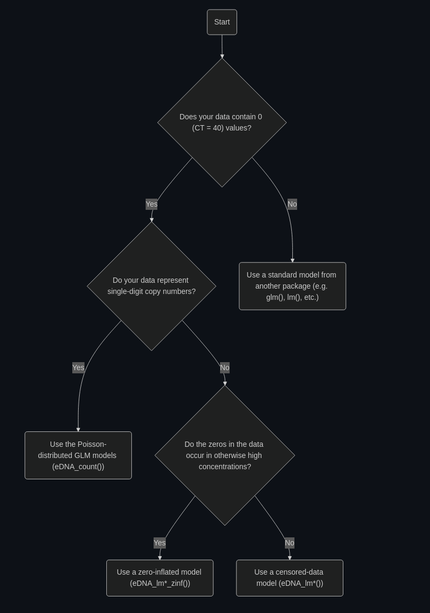

```{r, include = FALSE}
knitr::opts_chunk$set(
  collapse = TRUE,
  comment = "#>"
)
```

```{r setup, message = FALSE, warning = FALSE}
library(artemis)
compile_models(rewrite = FALSE)
```

- `eDNA_lm()`: Fixed effects censored data model with Normal errors. Use when threshold of detection is greater than single copies of DNA and there are no grouping variables (random effects)

- `eDNA_lmer()`: Mixed effects censored data model with Normal errors. Same as above, but there are grouping variables (random effects).

- `eDNA_zinf_lm/lmer()`: Same as above, but the response is zero-inflated (has more zero values than expected under the normal model assumptions).

- `eDNA_count_lm/lmer()`: Use when the threshold of detection is single copies of DNA. Requires the response to be converted to copy number (integer values). 


## Which model should I use?


